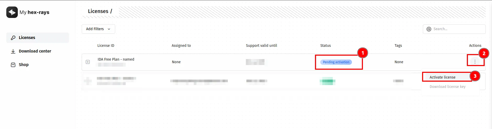
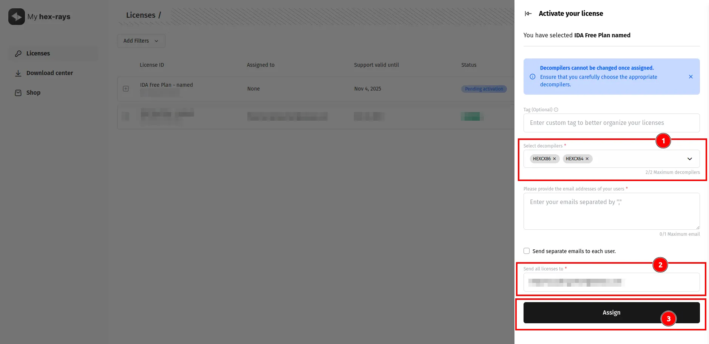
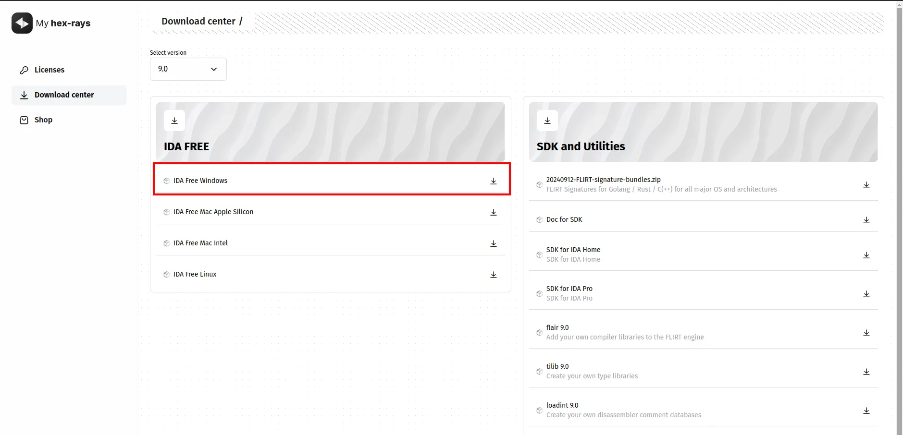

I used Flare VM for a while, but found it to be somewhat buggy and slow. This led me to explore alternatives, and I came up with the idea for this minimal setup. Inspired by [this video](https://www.youtube.com/watch?v=adAr0KBJm4U), this setup includes all the applications and tools I believe will cover most of my analysis needs for now.

This section includes the installation instructions for all the applications and tools I will be installing in the Minimal Setup.

## Default Applications

- I used [Ninite](https://ninite.com/) to download and install all essential tools at once, including browsers, runtimes, developer tools, and more. Below is an image showing the tools I selected to install on the VM. After selecting all the necessary tools, click the `Get Your Ninite` button to download the `Ninite` installer. This setup will automatically download and install all the selected tools.

  

- Once you've downloaded the Ninite installer, it's time to transfer it to the VM. First, click on `VM` -> `Grab Input` (as shown in the image below) to enable drag-and-drop functionality between the host and the guest system.

  

- Now drag-and-drop the installer to the VM as shown in the following the image.

  

- Now, double-click the installer to begin downloading and installing all the selected tools.

  

- You can see the progress of each application by clicking on the `Show details` button.

  

- Once the installation is finished without any errors you can close the installer.

  

- You can reuse the `Ninite` installer later to update and upgrade all the tools it initially installed.

## Sysinternals Suite

Created in 1996 by [Mark Russinovich](https://blogs.technet.microsoft.com/markrussinovich/), the [Sysinternals](https://learn.microsoft.com/en-us/sysinternals/) website hosts advanced system utilities and technical information. Sysinternals utilities are valuable for IT professionals and developers alike, offering tools to manage, troubleshoot, and diagnose both Windows and Linux systems and applications.

The Sysinternals Troubleshooting Utilities are packaged in a single collection known as the [Sysinternals Suite](https://learn.microsoft.com/en-us/sysinternals/downloads/sysinternals-suite). This package contains all the individual troubleshooting tools and help files. You can download the [SysinternalsSuite.zip](https://download.sysinternals.com/files/SysinternalsSuite.zip), transfer it to your VM, and extract it within the VM.

## Visual CPP Build Tools

- The [Microsoft C++ Build Tools](<[https://visualstudio.microsoft.com/visual-cpp-build-tools/](https://visualstudio.microsoft.com/visual-cpp-build-tools/)>) is necessary for building and installing some of the tools mentioned in this section. You can get the installer from the official site by clicking on the `Download Build Tools` button.

  

- Once you have download the installer, double-click on it to start the installation.

  

- Once the installer window is launched, select the `Desktop development with C++` option under the `Workloads` tab as shown in the image below and click on `Install`.

  

- Once the installation is completed, you can close the installer.

  

## Ghidra

- Ghidra is a opensource software reverse engineering (SRE) framework created and maintained by the [National Security Agency](https://www.nsa.gov/) Research Directorate. You can get the latest release [here](https://github.com/NationalSecurityAgency/ghidra/releases). Download the zip file as shown in the following image.

  

- Next extract the zip file.

  

- Once extracted, navigate to the extracted directory. Inside, you’ll find a `ghidraRun.bat` file. Double-click it to launch Ghidra. Note that Ghidra requires the Java JDK to run, which I have already installed using the `Ninite` installer in the [Default Applications](#Default-Applications) section.

  

- Ghidra is launched successfully as shown in the following image.

  

- **Ghidra Plugins / Scripts [ Optional ]**. You can find the installation documentation in the respective repositories
  - Ghidrathon - [https://github.com/mandiant/ghidrathon](https://github.com/mandiant/ghidrathon)
  - Capa - [https://github.com/mandiant/capa/tree/master/capa/ghidra](https://github.com/mandiant/capa/tree/master/capa/ghidra)
    - Capa rules - [https://github.com/mandiant/capa-rules](https://github.com/mandiant/capa-rules)
  - FindCrypt - [https://github.com/TorgoTorgo/ghidra-findcrypt](https://github.com/TorgoTorgo/ghidra-findcrypt)

## IDA

IDA (Interactive Disassembler) is a powerful, multi-processor disassembler and debugger that converts machine-executable code into assembly language source code. You can get the free version of IDA [here](https://hex-rays.com/ida-free). [Here](https://docs.hex-rays.com/getting-started/install-ida) is the official documentation for installing IDA.

- To install IDA, you'll need to create an account at [https://my.hex-rays.com/login](https://my.hex-rays.com/login) and log in to your dashboard. Once logged in, go to the `Shop` page and purchase the `IDA Free Plan`, as shown in the image below.

  

- Next go to the `Licenses` tab and activate the license of the entry with the status as `Pending Installation` as shown in the image below.

  

- Next choose the decompilers, enter your email address and then click on `Assign`.

  

- Now if you check the license entry, you can see that the status is updated to `Active`.

  

- Next go to the `Download center` tab and download the `IDA Free Windows` setup.

  

- Next download the license key from the `Licenses` tab by selecting the three dots and clicking on the `Download license key` option as shown in the following image.

  

- Now its time to install IDA. Double click on the IDA setup to start the installation. Just go with the defaults and let it finish the installation.

  

- Once the installation is completed, you can see message stating that the license key must be placed under the `%APPDATA%/Hex-Rays/Ida Pro` directory.

  

- As per the instruction, move the downloaded license key to the `%APPDATA%/Hex-Rays/Ida Pro` directory as shown in the following image. If the directory is `Hex-Rays/Ida Pro` is not present, manually create it.

  

- Now, double-click the IDA shortcut on the desktop, and you should see that IDA has launched successfully, as shown in the image below.

  

## PowerToys (Optional)

[Microsoft PowerToys](https://learn.microsoft.com/en-us/windows/powertoys/) is a set of utilities for power users to tune and streamline their Windows experience for greater productivity. You can install it from the Microsoft Store as shown in the image below.


## Yara

[YARA](https://virustotal.github.io/yara/) is a tool aimed at (but not limited to) helping malware researchers to identify and classify malware samples.

- You can get the latest release of Yara here: [https://github.com/virustotal/yara/releases/](https://github.com/virustotal/yara/releases/)

  

- After downloading the zip file, extract it, and you're ready to use Yara directly from the command line.

  

- For using Yara, we need Yara-Rules. You can get the Yara-Rules from the following repository: [https://github.com/Yara-Rules/rules/](https://github.com/Yara-Rules/rules/). Just clone the repository or download a zip of the entire repository and extract it.
  
- When using Yara, you'll need to specify the rules directory mentioned above each time Yara prompts for it.

## System Informer ( Formerly Process Hacker )

System Informer aka Process Hacker is a **free**, powerful, multi-purpose tool that helps you **monitor system resources**, **debug software** and **detect malware**.

- You can get the latest version of System Informer from the following link: [https://systeminformer.sourceforge.io/downloads.php](https://systeminformer.sourceforge.io/downloads.php)

  

- Once you have downloaded the installer, run the installer. Click on `Install` as shown in the image below.

  

- Again click on `Install`.

  

- Once the installation is complete, launch System Informer. You should see that it has been installed successfully, as shown in the image below.

  

## PeStudio

PeStudio is a powerful software analysis tool used to analyze executable files (PE files) for Windows operating systems. It provides users with a detailed analysis of the file’s properties, characteristics, and potential risks. The goal of pestudio is to spot artifacts of executable files in order to ease and accelerate Malware Initial Assessment.

- You can get the free version of `PeStudio` from the following link: [https://www.winitor.com/download](https://www.winitor.com/download).

  

- `PeStudio` requires no installation and, thus you can directly double-click on the download exe file to launch `PeStudio`.

  

- `PeStudio` is successfully installed as shown in the following image.

  

## Resource Hacker

[Resource Hacker](https://www.angusj.com/resourcehacker/) is a resource editor for `32bit` and `64bit` Windows® applications. It's both a **resource compiler** (for `*.rc` files), and a **decompiler** - enabling viewing and editing of resources in executables (`*.exe`; `*.dll`; `*.scr`; etc) and compiled resource libraries (`*.res`, `*.mui`).

- You can get the latest version of Resource Hacker Installer here: [https://www.angusj.com/resourcehacker/#download](https://www.angusj.com/resourcehacker/#download)

  

- Once you have downloaded the installer, run it. Go with the default configuration and click on `Next`.

  

- After the installation is complete, check the `Launch Resource Hacker` option to verify that it installed correctly, then click `Finish`.

  

- Resource Hacker is launched successfully as shown in the following image.

  

## Pe-Bear

[PE-bear](https://hshrzd.wordpress.com/pe-bear/) is a multiplatform reversing tool for PE files. Its objective is to deliver fast and flexible “first view” for malware analysts, stable and capable to handle malformed PE files.

- You can find the latest version PE-bear here: [https://github.com/hasherezade/pe-bear/releases](https://github.com/hasherezade/pe-bear/releases)

  

- Extract the downloaded zip file and double-click on `PE-bear.exe` to launch it as shown in the image below.

  

## dnSpy

[dnSpy](https://github.com/dnSpy/dnSpy) is a debugger and .NET assembly editor. You can use it to edit and debug assemblies even if you don't have any source code available.

- You can get the latest version of dnSpy here: [https://github.com/dnSpy/dnSpy/releases/tag/v6.1.8](https://github.com/dnSpy/dnSpy/releases/tag/v6.1.8)

  

- Extract the downloaded zip file, navigate into the extracted directory and double-click on `dnSpy.exe` to launch it as shown in the following image.

  

## HxD Hex Editor

[HxD](https://mh-nexus.de/en/hxd/) is a [fast free hex editor](https://mh-nexus.de/en/hxd/) that can open files of any size (up to 8EB), gives raw read/write access to disks and main memory (RAM), still being as easy to use as any text-editor.

- You can get the latest version of HxD Editor from the following link: [https://mh-nexus.de/en/downloads.php?product=HxD20](https://mh-nexus.de/en/downloads.php?product=HxD20)

  

- Run the downloaded installer and allow it to complete the installation process.

  

- After the installation is complete, double-click the HxD shortcut on the desktop to launch the HxD editor. You should see it open successfully, as shown in the image below.

  

## x64dbg

[x64dbg](https://github.com/x64dbg/x64dbg) is an open-source binary debugger for Windows, aimed at malware analysis and reverse engineering of executables you do not have the source code for.

- You can get the latest version of x64dbg here: [https://github.com/x64dbg/x64dbg/releases](https://github.com/x64dbg/x64dbg/releases)

  

- After downloading the zip file, extract it and navigate into the extracted folder. Inside, you'll find two folders: `x32` and `x64`, containing the executables for each architecture. These are standalone executables and can be run directly by double-clicking.

  

## WinDbg

[WinDbg](https://learn.microsoft.com/en-us/windows-hardware/drivers/debugger/) is a debugger that can be used to analyze crash dumps, debug live user-mode and kernel-mode code, and examine CPU registers and memory.

- You can get the latest version installer in the following link or you can also install it from the Microsoft store.
  [https://learn.microsoft.com/en-us/windows-hardware/drivers/debugger/#install-windbg-directly](https://learn.microsoft.com/en-us/windows-hardware/drivers/debugger/#install-windbg-directly)

  

- Once you have downloaded the installer, run it and allow it complete the installation process.

  

## Regshot

Regshot is an open-source (LGPL) registry compare utility that allows you to quickly take a snapshot of your registry and then compare it with a second one - done after doing system changes or installing a new software product.

- You can get the latest version here: [https://sourceforge.net/projects/regshot/](https://sourceforge.net/projects/regshot/)

  

- Extract the zip file and navigate to the extracted folder. The `exe` files present in this folder are standalone executables and can be run directly by double-clicking.

  

## DIE - Detect It Easy

[**Detect It Easy (DiE)**](https://github.com/horsicq/Detect-It-Easy/) is a powerful tool for file type identification, popular among **malware analysts**, **cybersecurity experts**, and **reverse engineers** worldwide.

- You can get the latest version of DiE here: [https://github.com/horsicq/DIE-engine/releases](https://github.com/horsicq/DIE-engine/releases)

  

- Extract the downloaded zip file. The `die.exe` file is a standalone executable that can be run directly by double-clicking it.

  

## ExeInfo PE

ExeInfo PE is a Free Windows Software which is used to detect packer, compiler, protector, .NET obfuscator, PUA application or Binary packed data such as `rar`, `zip`, `iso`, `7zip`, `zx`, `sqz`, `lz4`, `img`.

- You can get the latest release here: [https://github.com/ExeinfoASL/ASL/releases](https://github.com/ExeinfoASL/ASL/releases)
  

- Extract the downloaded zip file and you can find the standalone executable inside the extracted directory.

  

## PEiD

**PEiD** is an intuitive application that relies on its user-friendly interface to detect packers, cryptors and compilers found in PE executable files – its detection rate is higher than that of other similar tools since the app packs more than 600 different signatures in PE files.

- You can get the latest version of PEiD here: [https://www.softpedia.com/get/Programming/Packers-Crypters-Protectors/PEiD-updated.shtml](https://www.softpedia.com/get/Programming/Packers-Crypters-Protectors/PEiD-updated.shtml)

  

- Extract the downloaded zip file and you can find the standalone executable inside the extracted directory.

  

## UPX

[**UPX**](https://upx.github.io/) is a free, secure, portable, extendable, high-performance **executable packer** for several executable formats.

- You can find the latest version of UPX here: [https://github.com/upx/upx/releases](https://github.com/upx/upx/releases)
  

- After downloading the zip file, extract it and navigate into the extracted folder, where you'll find the `upx.exe` standalone command-line executable.

  

## AutoIt-Ripper

[AutoIt-Ripper](https://github.com/nazywam/AutoIt-Ripper) is a short python script that allows for extraction of "compiled" `AutoIt` scripts from PE executables.

- You can install the latest version of AutoIt-Ripper by using the following pip command:

  ```powershell
  python3 -m pip install autoit-ripper
  ```

- You should see the output shown in the image below once AutoIt-Ripper is successfully installed.

  

---
