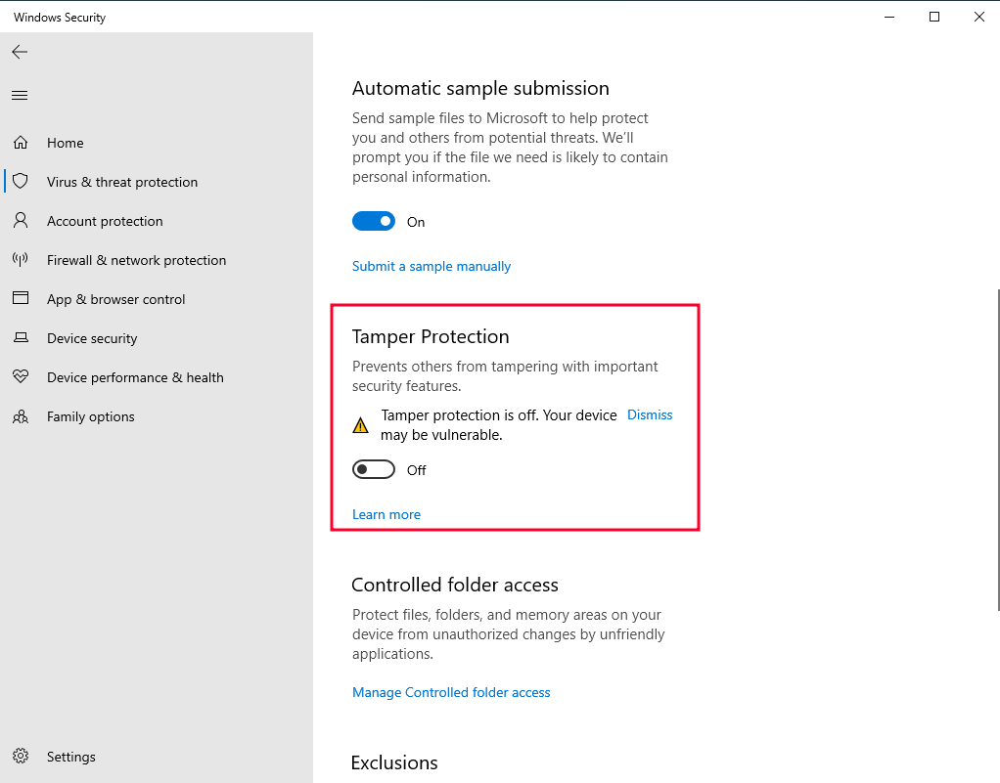
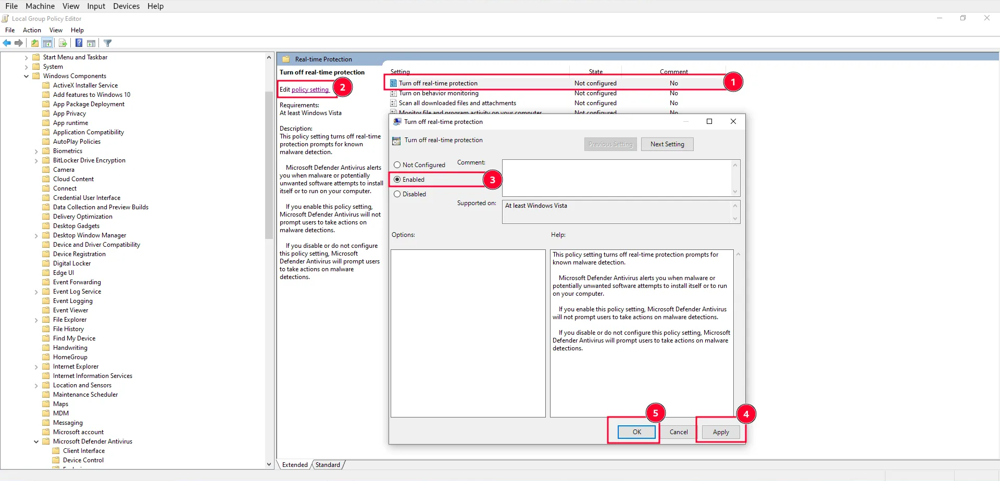
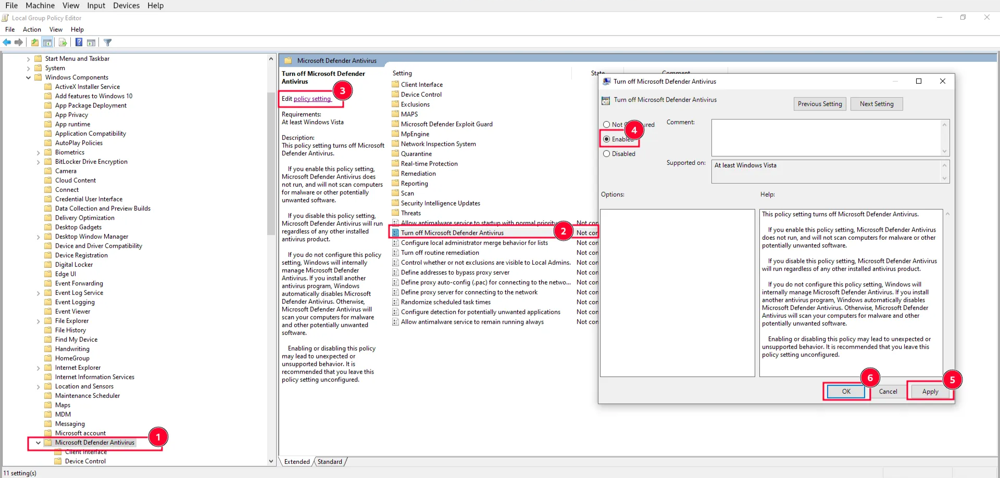
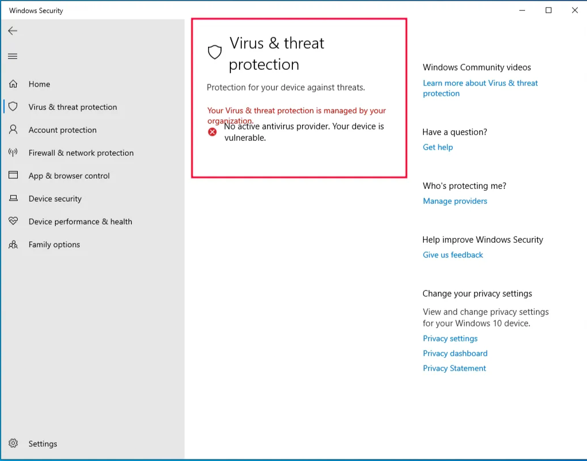

Before installing any tools, it's necessary to disable all antivirus software, as we will be storing and testing malware on this VM, which may be removed or quarantined by the antivirus. Since this is a fresh installation of Windows, the only antivirus we need to disable is Microsoft Defender. To completely disable Microsoft Defender, follow these steps:

- Disable Tamper Protection and any Anti-Malware solution (e.g., Windows Defender), preferably via Group Policy.[https://stackoverflow.com/questions/62174426/how-to-permanently-disable-windows-defender-real-time-protection-with-gpo](https://superuser.com/a/1757341)
  - In Windows 10 1903, Tamper Protection was added.
  - Tamper Protection must be disabled *before* changing Group Policy settings, otherwise these are ignored.
    1.  Open Windows Security (type `Windows Security` in the search box)
    2.  `Virus & threat protection` > `Virus & threat protection settings` > `Manage settings`
    3.  Switch `Tamper Protection` to `Off`
        
- Open Local Group Policy Editor (type `gpedit.msc` in the search box)
  
- To permanently disable real-time protection:

  1. `Computer Configuration` > `Administrative Templates` > `Windows Components` > `Microsoft Defender Antivirus` > `Real-time Protection`
  2. Enable `Turn off real-time protection`

     

  3. Restart the computer

- To permanently disable Microsoft Defender:
  1. `Computer Configuration` > `Administrative Templates` > `Windows Components` > `Microsoft Defender Antivirus`
     
  2. Enable `Turn off Microsoft Defender Antivirus`
  3. Restart the computer
- You should see something like the following image after you have performed the above mentioned steps.
  
