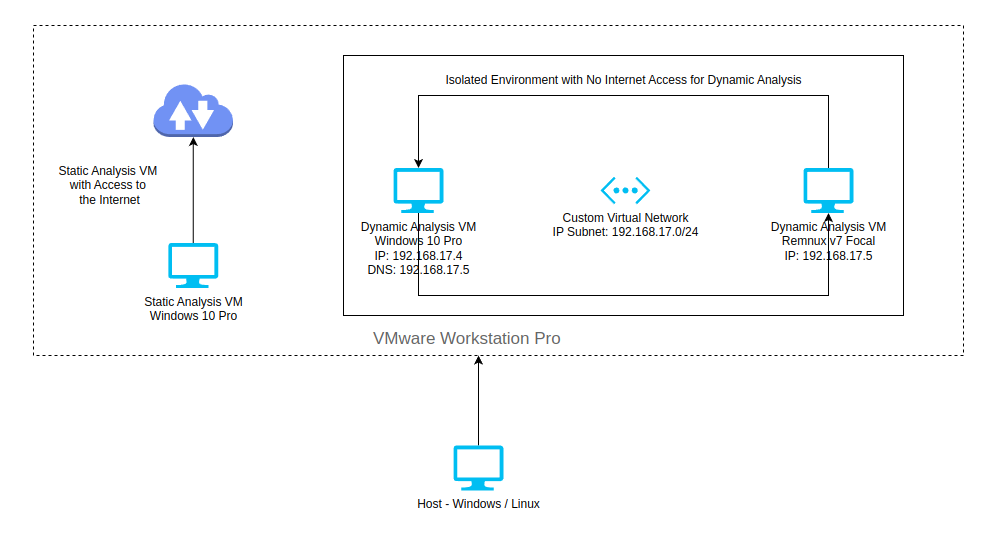

The lab environment includes one virtual machine for static analysis and two virtual machines for dynamic analysis. The setup is shown in the image below.

---

## Static Analysis VM Configuration

I used a Windows 10 Pro virtual machine (VM) for static analysis since I primarily work with Windows-based malware. If you are analyzing Linux-based malware, consider setting up a Linux-based static analysis VM, such as a Remnux VM. This Linux VM should be configured similarly to the Windows 10 Pro static analysis VM detailed below.

The hardware requirements for the static analysis VM is listed below.

### Windows 10 Pro

| Name                      | Windows 10 Pro |
| ------------------------- | -------------- |
| Version                   | Version 22H2   |
| Architecture              | 64-bit         |
| Minimum RAM               | 2 GB           |
| Recommended RAM           | ≥ 4 GB         |
| Internet Access           | Yes            |
| Microsoft Defender Status | OFF            |

---

## Dynamic Analysis VMs Configuration

For dynamic analysis, I used two virtual machines (VMs): a Windows 10 Pro VM to execute and monitor the malware’s behavior, and a Remnux VM to simulate network services, including DNS. The DNS on the Windows 10 Pro VM is configured to route through the DNS provided by the Remnux VM, simulating a realistic network environment for comprehensive malware testing. Wireshark is also set up on the Remnux VM to capture all network traffic generated by the Windows 10 Pro VM. Both dynamic analysis VMs are isolated in a separate virtual network to prevent access to the host network and the public internet.

This dynamic analysis setup is designed for Windows-based malware. For Linux-based malware, you can replace the Windows 10 Pro VM with a second Remnux VM, configuring its DNS to route through the Remnux VM that hosts the fake network services.

The hardware requirements for the dynamic analysis VMs are listed below.

### Windows 10 Pro

| Name                      | Windows 10 Pro |
| ------------------------- | -------------- |
| Version                   | Version 22H2   |
| Architecture              | 64-bit         |
| Minimum RAM               | 2 GB           |
| Recommended RAM           | ≥ 4 GB         |
| Internet Access           | No Access      |
| DNS                       | Remnux VM IP   |
| Microsoft Defender Status | OFF            |

### Remnux V7 Focal

| Name            | Ubuntu             |
| --------------- | ------------------ |
| Version         | Ubuntu 20.04.4 LTS |
| Architecture    | 64-bit             |
| Minimum RAM     | 2 GB               |
| Recommended RAM | ≥ 4 GB             |
| Internet Access | No Access          |
